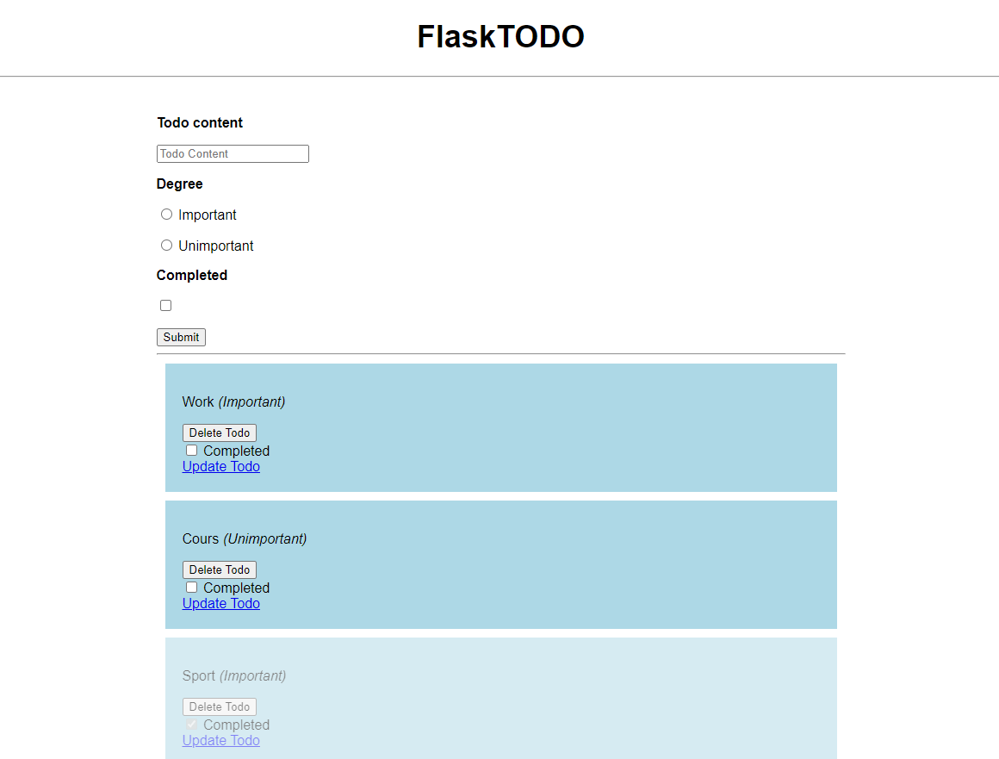
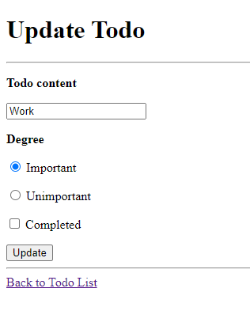
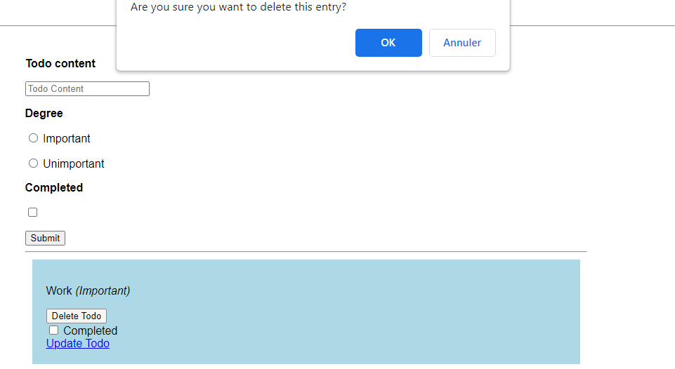

# TODO Application

## Introduction

This is a simple TODO application built with Flask and MongoDB. Users can create, update, and delete tasks as well as mark them as complete.

## Installation

1. Clone the repository
2. Install the required packages
3. Set up a MongoDB database and obtain the connection URI.
4. Update the `uri` variable in `app.py` with the connection URI.

## Usage

1. Run the application: `python app.py`
2. Open a web browser and navigate to http://localhost:5000/ to access the application.

### Home page

### Update page

### Delete

## Code Overview

The main file for the application is `app.py`. Here's an overview of what each section of the code does:

- **Imports** - The necessary packages are imported, including Flask, PyMongo, and ObjectId.
- **Connection to MongoDB** - The connection URI is set up, and a connection to the MongoDB server is established.
- **Flask application** - The Flask application is created, and the database connection is passed to it.
- **Routes** - The different routes for the application are defined, including the homepage, task creation, task deletion, task update, and task completion.
- **Templates** - The HTML templates for the different pages of the application are defined in the `templates` directory.
